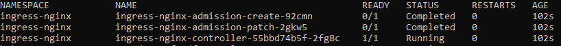

      
    
    

# Sistema de monitoração patrimonial integrado a detecção de incêndio e acionamento.
Este repositório possui os códigos-fonte, DockerImages, ClusterConfigs, e outros arquivos necessários para a contrução do projeto.
O sistema propõe a monitoração de patrimônios, utilizando principamente de sistemas de monitoramento, sistemas de alarme e sistemas de abertura de fechaduras remotamente.
## Vídeomonitoramento
### Circuito de câmeras:
O sistema de monitoramento conta com um circuito de câmeras, posicionadas de acordo com a necessidade do cliente e em locais estratégicos visando cobrir a maior área do imóvel possível. Essa rede de câmeras é conectada a uma raspberry, tecnologia que possui um sistema operacional linux, responsável por tratar as imagens recebidas das câmeras a partir da inteligência artificial, descrita abaixo. Após o tratamento das inagens, as mesmas são enviadas a partir de um POST ao servidor de banco de dados, onde serão armazenadas as imagens para consulta do cliente.
### Raspberry Pi
A raspberry possui um sistema operacional Linux, ambiente responsável por receber as imagens recebidas a partir de um módulo de imagem, enviadas a partir do circuito de câmeras acima. Após o recebimento, o SO executa a Inteligência artificial descrita abaixo passando as imagens recebidas como parâmetro para tratamento. Após o tratamento da imagem, os arquivos são enviados a um servidor responsável por armazenar no banco de dados e apresentar ao cliente.
### Inteligência artificial
A inteligência artificial é responsável por analisar as imagens recebidas como parâmetro, com o objetivo de detectar possíveis frames onde exista principios de incêndios. Após a análise, um script deve formatar a imagem em <extensão do arquivo> e enviar ao servidor (descrição abaixo).
Caso o retorno seja verdadeiro para incêndio, um script deve fazer um POST na API destinada, informando o incêndio, após realizar o POST, a ML deve continuar a validação para a próxima imagem. Em caso de não detecção, o sistema deve seguir a validação para a próxima imagem.
### Servidor
O ambiente do servidor está rodando no Google Cloud Provider, orquestrando as tecnologias implementadas a partir do kubernetes. O servidor possui o Kong como API gateway, responsável por receber as imagens.
- Kong:
  
      Envia os dados recebidos para o service NGINX.
  
- Service NGINX:

      O Service NGINX é responsável por enviar os dados para o deployment definido na configuração, a partir de um parâmetro enviado do pelo Kong.

- Deployment:
    - Deployment de dados:
    
          O deployment é responsável por formatar os dados para o formato exigido pelo banco de dados e inseri-lo no banco de dados.
    
    - Deployment de alarme:
 
          O deployment é responsável por atualizar o estado do alarme de incêndio no banco de dados.

    - Deployment de disparo de mensagem:
 
          O deployment é responsável por disparar uma mensagem via WhathsApp ou SMS, informando o Alarme.

A cada execução de cada serviço, o servidor deve formatar e armazenar corretamente os logs dos serviços executados, para que em caso de falha, seja possível realizar uma análise detalhada, conforme campos abaixo.

- Tempo de resposta;
- Status da transação;
- TID da transação;
- Request e response;
- ClientId.
  
Além disso, o serviço deve possuir o grafana para análise de gráficos e detecção de possíveis impactos no ambiente.
#
## Front-End

## Dashboard de visualização
### Sistema de vídeomonitoramento
O dashboard para o vídeomonitoramento é montado a partir de uma estrutura bootstrap, que contém contâiners de acordo com a quantidade de câmeras definidas pelo backend da aplicação. O funcionamento se dá a partir da seguinte forma:

Ao acessar a URL de entrada do servidor, o usuário deve realizar o login. O login se dá a partir de um usuário e senha definidos na criação do cliente, assim que o mesmo é registrado no sistema. A partir do login, o dashboard com as imagens em tempo real já são exibidas, as câmeras são selecionadas a partir das credenciais, onde o ID da câmera recebe um campo do cliente.

Além do campo com as imagens, o dashboard deve exibir o status do alarme de incêndio ao lado do contâiner da câmera em si, conforme anexo. A validação do status do alarme deve ser feito a cada determinado periodo de tempo, e atualizado de acordo com o status retornado.

       
    
    

O fluxograma do projeto explica melhor como tudo é orgnizado, é só <a href="https://lucid.app/lucidchart/2824418b-d959-4b2d-95af-7359e57d9a1c/edit?viewport_loc=531%2C-489%2C3700%2C1812%2C0_0&invitationId=inv_301b8d16-d85c-4215-a002-cb2809fac652"> clicar aqui!</a>

## Para começar

### Cluster
Para começar, é necessário criar um cluster, seja em uma intância local ou em cloud, o importante é iniciar o cluster. Ao acessar o arquivo `patromonial-system/cloud_system/cluster/cluster_config.yaml`, você irá acessar o arquivo de configuração do cluster. Par executa-lo, é necessário o seguinte comando:

    kind create cluster --config cluster_config.yaml --name patrimonial-system-cluster

Após a execução do mesmo, o cluster será criado e estará pronto para uso.

Para o projeto é necessário a utilização de ingress, ou seja, é necessário um ingress controller. O ingress controler é responsável por gerenciar os nossos ingress. Iremos utilizar o Nginx Ingress Controler, pois é amplamente adotado e bem documentado. Para utiliza-lo, executaremos o comando abaixo, responsável por criar um deployment para o Ingress controler.

      kubectl apply -f https://raw.githubusercontent.com/kubernetes/ingress-nginx/master/deploy/static/provider/kind/deploy.yaml

Após a execução do comando, se executarmos o comando `kubectl get pods -A` iremos obter o retorno abaixo. Os pods devem estar exatamente conforme a imagem.

Após a execvução dos passos acima, estamos prontos para iniciar a configuração do ambiente executado dentro do cluster.

### Namespaces

Foi definido três namespaces para o ambiente do cluster.
- fr-alarm-prd
- pm-alarm-prd
- rec-img-prd

O `fr-alarm-prd` é a namespace onde todos os componentes relacionados a alarme de incêndio foram instalados, ou seja, qualquer componente que tenha relação com o alarme de incêncio, tem a namespace `fr-alarm-prd`

O `pm-alarm-prd` é a namespace onde todos os componentes relacionados a alarme de perimetro foram instalados, ou seja, qualquer componente que tenha relação com alarmes de perímetro, possui a namespace `pm-alarm-prd`

O `rec-img-prd` é a namespace onde todos componentes relacionados a gravação, reprodução e outras operações com imagens, ou seja, qualquer componente que tenha relação com imagens, possui a namespace `rec-img-prd`
